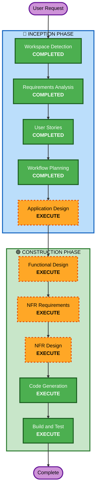

# Execution Plan

## Detailed Analysis Summary

### Change Impact Assessment
- **User-facing changes**: Yes — entirely new public-facing web app
- **Structural changes**: Yes — new system architecture (Next.js + Airtable + Claude + Maps)
- **Data model changes**: Yes — Airtable schema design needed
- **API changes**: Yes — new serverless API routes for LLM, Airtable, Maps
- **NFR impact**: Yes — security (public app), performance (LLM latency), rate limiting

### Risk Assessment
- **Risk Level**: Medium (multiple integrations, public-facing, LLM unpredictability)
- **Rollback Complexity**: Easy (greenfield, no existing system to break)
- **Testing Complexity**: Moderate (LLM responses non-deterministic, Maps API mocking)

---

## Workflow Visualization



### Text Alternative
```
Phase 1: INCEPTION
- Workspace Detection (COMPLETED)
- Requirements Analysis (COMPLETED)
- User Stories (COMPLETED)
- Workflow Planning (COMPLETED)
- Application Design (EXECUTE)

Phase 2: CONSTRUCTION (single unit)
- Functional Design (EXECUTE)
- NFR Requirements (EXECUTE)
- NFR Design (EXECUTE)
- Code Generation (EXECUTE)
- Build and Test (EXECUTE)
```

---

## Phases to Execute

### 🔵 INCEPTION PHASE
- [x] Workspace Detection (COMPLETED)
- [x] Requirements Analysis (COMPLETED)
- [x] User Stories (COMPLETED)
- [x] Workflow Planning (COMPLETED)
- [ ] Application Design - **EXECUTE**
  - **Rationale**: New components needed (Chat service, Airtable adapter, Maps integration, LLM orchestrator). Service layer design required.
- [ ] Units Generation - **SKIP**
  - **Rationale**: Single deployable unit (Next.js app with API routes). No need for multi-unit decomposition.

### 🟢 CONSTRUCTION PHASE (Single Unit: "travel-chatbot")
- [ ] Functional Design - **EXECUTE**
  - **Rationale**: Complex business logic (itinerary optimization, proximity ranking, recommendation scoring, list CRUD operations)
- [ ] NFR Requirements - **EXECUTE**
  - **Rationale**: Security (public app, API key protection, rate limiting), performance (LLM caching), scalability needed
- [ ] NFR Design - **EXECUTE**
  - **Rationale**: NFR patterns need incorporation (middleware for rate limiting, API route protection, caching strategy)
- [ ] Infrastructure Design - **SKIP**
  - **Rationale**: Vercel handles infrastructure. No custom cloud resources to design (Airtable is SaaS, Maps is SaaS, Claude is SaaS).
- [ ] Code Generation - **EXECUTE** (ALWAYS)
  - **Rationale**: Implementation planning and code generation
- [ ] Build and Test - **EXECUTE** (ALWAYS)
  - **Rationale**: Build verification and test instructions

### 🟡 OPERATIONS PHASE
- [ ] Operations - PLACEHOLDER

---

## Success Criteria
- **Primary Goal**: Deployable web app that serves as a conversational Tokyo travel guide
- **Key Deliverables**: Next.js app, Claude integration, Airtable CRUD, embedded Google Maps, responsive chat UI
- **Quality Gates**: All stories' acceptance criteria met, security rules enforced, partial PBT on algorithmic core
